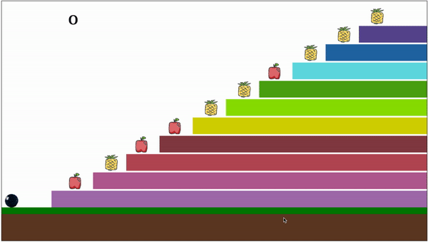

# AuroEducative
We are using roadside screens to educate out of school children through gamification.
We display advertisements on these screens in idle time to generate revenue for self-sustainability.

## Getting Started
1. Import this project in android studio. 
2. Run the project on Android TV AVD(Android Virtual device).

## Built With

* Android Studio
* Java
* JavaScript
* HTML Canvas

## Ads
The system keeps playing advertisements until someone presses a key on the casing. When any key is pressed or a finger is placed on the fingerprint sensor, a lesson is shown in the form of a video that teaches the required skills for playing the game. After the lesson ends, users are forwarded to the game where they can play the game and test their knowledge they just learned in the lesson. Upon completion of the game, or the game being idle for too long, the system turns on the advertisements again and continues them, waiting for other kids to come.

## Game

The system consists of short videos and interactive games which helps children to learn and have basic skills of reading, writing, and arithmetic. Besides the educational things, the system teaches them the basic etiquette of hygiene that other children learn from schools or the internet.

